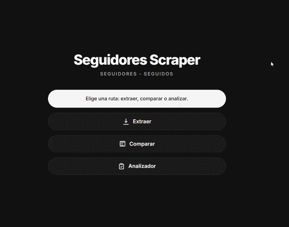
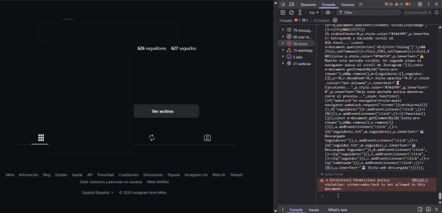
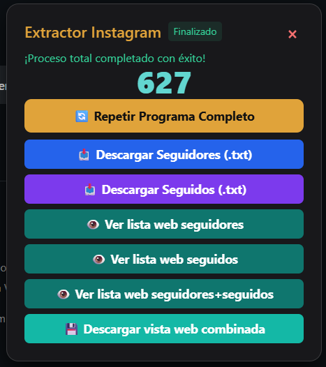
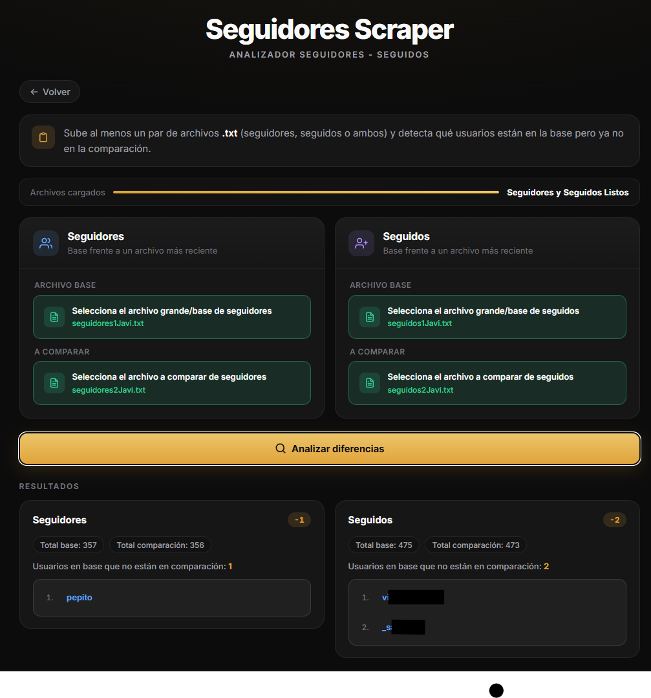

<p align="center">
  
</p>

<h1 align="center">Seguidores Scraper</h1>

Compara listas de **seguidores** y **seguidos** entre dos fechas.

**1.** Abre [extraer](https://josejavierdiazgonzalez.github.io/seguidores-scraper/extraer/) y pulsa **Copy code**.

<p align="center">
  
</p>

**2.** En Instagram: perfil → `F12` → **Console** → pega y **Enter**.

<p align="center">
  
</p>

**3.** Al terminar, descarga los `.txt` de seguidores y seguidos. El nombre debe empezar por `seguidores` o `seguidos`.

<p align="center">
  
</p>

**4.** Abre [analizador](https://josejavierdiazgonzalez.github.io/seguidores-scraper/analizador/), carga los `.txt` y elige **base** y **comparación** para seguidores y seguidos.

<p align="center">
  
</p>

---

Usa estas herramientas solo sobre **tu cuenta** o con permiso. Respeta los términos de Instagram y la privacidad de terceros.

---

## Clonar el repo y ejecutarlo en local

Solo si quieres modificar el código, usar el comparador en terminal o desplegar tu propia copia.

### Requisitos

- [Node.js](https://nodejs.org/)
- Navegador con Instagram (sesión iniciada)

### Paso a paso

```bash
git clone https://github.com/josejavierdiazgonzalez/seguidores-scraper.git
cd seguidores-scraper
npm install
npm run build
```

- **Extraer / comparar:** `public/extraer/index.html`, `public/comparar/index.html` o GitHub Pages.
- **Comparador en terminal:** `npm run comparador` (`.txt` en `scraper/<cuenta>/`).
- **Analizador:** `public/analizador/index.html` o `/analizador/` en Pages.

### Estructura del proyecto

```text
seguidores-scraper/
├── scripts/
│   ├── comparador-txt.js
│   └── build.js
├── public/
│   ├── index.html
│   ├── extraer/index.html
│   ├── comparar/index.html
│   └── analizador/index.html
├── images/
├── package.json
├── ejemplo/
└── scraper/                       # gitignore
```

### Mantenimiento

**Extraer** - tras editar el `.js` en `otros/`:

```bash
npm run build
```