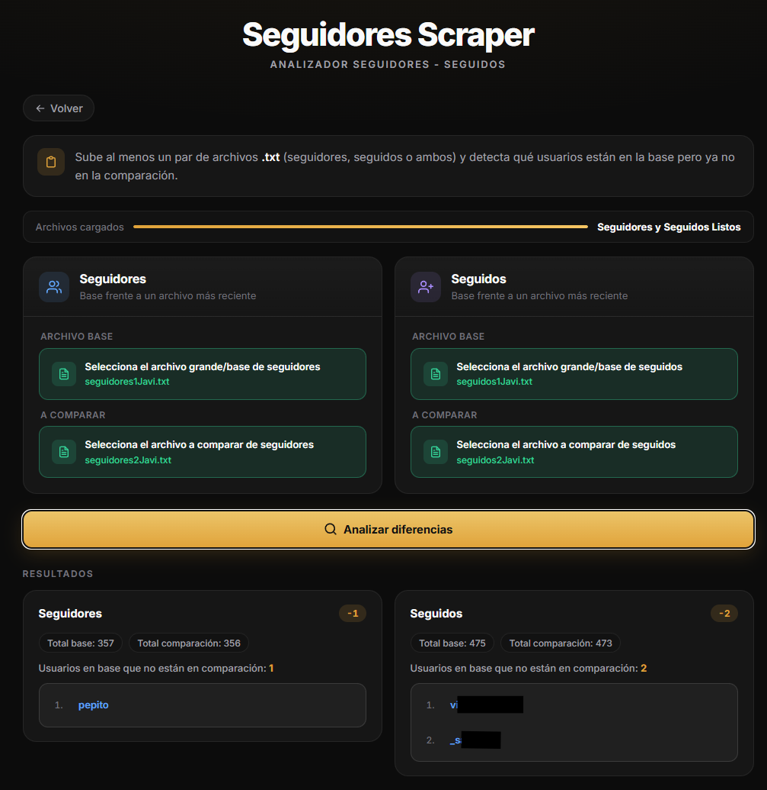
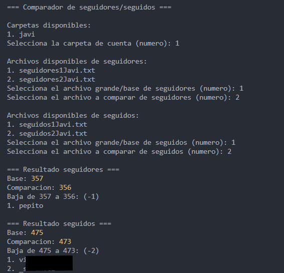

<p align="center">
  
</p>

<h1 align="center">Seguidores Scraper</h1>

<p align="center">
  Compara listas de <strong>seguidores</strong> y <strong>seguidos</strong> entre dos fechas.
</p>

<p align="center">
  <a href="https://josejavierdiazgonzalez.github.io/seguidores-scraper/extraer/">Extraer</a>
  ·
  <a href="https://josejavierdiazgonzalez.github.io/seguidores-scraper/comparar/">Comparar</a>
  ·
  <a href="https://josejavierdiazgonzalez.github.io/seguidores-scraper/analizador/">Analizador</a>
</p>

---

<a id="1-copiar-codigo"></a>

## 1. Copiar código

Entra en [Extraer](https://josejavierdiazgonzalez.github.io/seguidores-scraper/extraer/), pulsa **Copy code** y copia el script.

<p align="center">
  
</p>

---

## 2. Consola de Instagram

Abre tu perfil, pulsa `F12`, ve a **Console**, pega el código y pulsa **Enter**.

<p align="center">
  
</p>

---

## 3. Descargar `.txt`

Cuando termine el proceso, descarga seguidores y seguidos. Nómbralos empezando por `seguidores` o `seguidos`.

<p align="center">
  
</p>

---

## 4. Analizador

En [Analizador](https://josejavierdiazgonzalez.github.io/seguidores-scraper/analizador/), sube los archivos y elige cuál es la **base** y cuál la **comparación** (seguidores y seguidos por separado).

<p align="center">
  
</p>

---

<sub>Usa estas herramientas solo sobre **tu cuenta** o con permiso. Respeta los términos de Instagram y la privacidad de terceros.</sub>

<details>
<summary><strong>Clonar el repo y ejecutarlo en local</strong></summary>

<br>

Para modificar el código, usar el comparador en terminal o desplegar tu propia copia.

### Requisitos

- [Node.js](https://nodejs.org/)
- Navegador con Instagram (sesión iniciada)

### Instalación

```bash
git clone https://github.com/josejavierdiazgonzalez/seguidores-scraper.git
cd seguidores-scraper
npm install
```

`npm run build` solo hace falta si vas a regenerar el **Copy code** de extraer/comparar tras editar los scripts en `otros/`.

### Carpeta `scraper/` (tus `.txt`)

Crea una carpeta por cuenta y guarda ahí todos los `.txt` de seguidores y seguidos:

```text
scraper/
└── javi/
    ├── seguidores1Javi.txt
    ├── seguidores2Javi.txt
    ├── seguidos1Javi.txt
    └── seguidos2Javi.txt
```

- El nombre debe **empezar por** `seguidores` o `seguidos` (así el comparador sabe el tipo).
- **Seguidores** y **seguidos** van en la misma carpeta de la cuenta, mezclados.
- `scraper/` está en `.gitignore`: es solo local.

Archivos de ejemplo y más detalle en [`ejemplo/`](ejemplo/).

### Comparador en terminal

```bash
npm run comparador
```

Elige la carpeta de cuenta, luego archivo **base** y **comparación** para seguidores y para seguidos.

<p align="center">
  
</p>

### Páginas en local

| Qué | Ruta local | GitHub Pages |
|-----|------------|--------------|
| Menú | `public/index.html` | [/](https://josejavierdiazgonzalez.github.io/seguidores-scraper/) |
| Extraer | `public/extraer/index.html` | [/extraer/](https://josejavierdiazgonzalez.github.io/seguidores-scraper/extraer/) |
| Comparar | `public/comparar/index.html` | [/comparar/](https://josejavierdiazgonzalez.github.io/seguidores-scraper/comparar/) |
| Analizador | `public/analizador/index.html` | [/analizador/](https://josejavierdiazgonzalez.github.io/seguidores-scraper/analizador/) |

### Estructura del proyecto

```text
seguidores-scraper/
├── scripts/
│   ├── comparador-txt.js          # npm run comparador
│   └── build.js                   # npm run build
├── public/                        # GitHub Pages
│   ├── index.html
│   ├── extraer/index.html
│   ├── comparar/index.html
│   └── analizador/index.html
├── images/                        # Capturas del README
├── ejemplo/                       # .txt de muestra
├── scraper/                       # gitignore (tus exportaciones)
├── otros/                         # gitignore (fuentes del extractor)
└── package.json
```

### Mantenimiento

**Extraer** - tras editar el `.js` en `otros/`:

```bash
npm run build
```

**Comparar** - minificado en `otros/comparar-minified.js` y el mismo `npm run build`.

Commit de `public/extraer/index.html` y `public/comparar/index.html` + push. GitHub Actions publica `public/` solo cuando cambia `public/**`.

</details>
